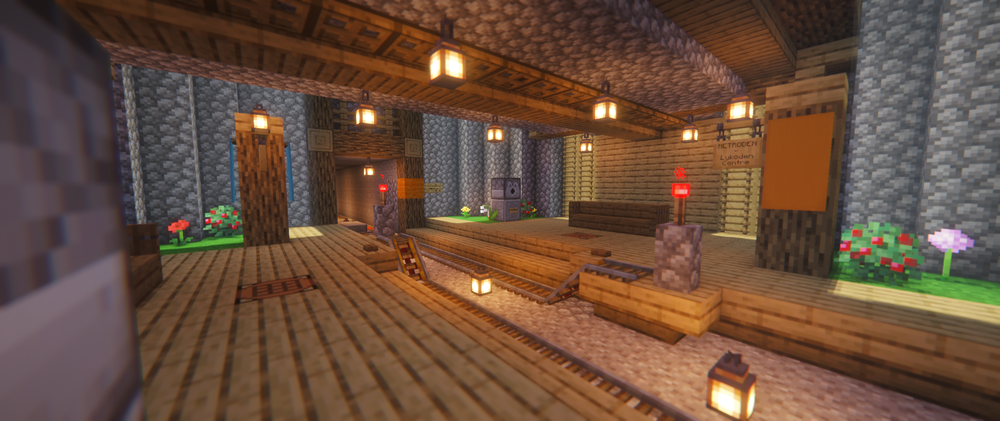

# Metroden

Site HTML simple qui sert de carte du réseau de métro de Lykoden, notre serveur Minecraft.

Le site  utilise notamment les bibliothèques [svg-pan-zoom](https://github.com/bumbu/svg-pan-zoom) et [hammerjs](https://hammerjs.github.io/) pour gérer la carte interactive.
